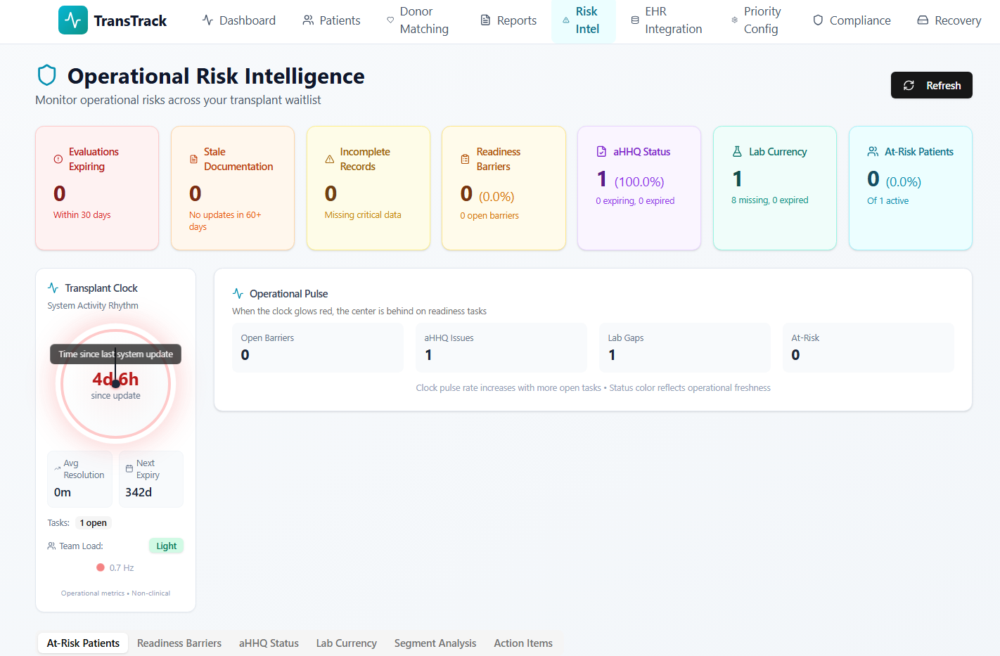

# TransTrack

## Transplant Waitlist & Operations Management

[](docs/compliance/HIPAA_SECURITY_RULE_MAPPING.md)
[](docs/compliance/PART_11_CONTROL_MAPPING.md)
[]()

TransTrack is an offline-first desktop application for transplant centers and pre-transplant coordination teams. It is **architected to support** HIPAA Security Rule controls and **designed for alignment with** FDA 21 CFR Part 11 electronic-records requirements; formal certification is the responsibility of the deploying organization and its auditors. It provides secure, cloud-independent data management and operational risk intelligence to help reduce the risk of patient inactivation before transplant.

> **Important:** "HIPAA aligned" and "Part 11 architected" describe the product's design controls — they are not certifications. SOC 2 / HITRUST / 21 CFR Part 11 validation, and any FDA determinations, must be performed by the deploying organization with qualified auditors.

> **Licensing Notice:** TransTrack is proprietary software. Use, operation, and deployment require a valid license activation issued by TransTrack Medical Software. Unauthorized use, redistribution, or rebranding is prohibited.

> **Impersonation and Safety Warning:** The project has identified unaffiliated third-party pages impersonating TransTrack. Do not download installers, archives, or updates from unofficial pages. Use only the official repository and releases listed below.

> **Known Unaffiliated Page (Do Not Use):** `https://the-vishal-gupta.github.io/` is not an authorized TransTrack channel. Treat downloads or links from that page as unsafe.

<p align="center">
  
</p>

## Demo

[Watch or download the demo video](https://github.com/NeuroKoder3/TransTrackMedical-TransTrack/releases/download/v1.0.0/TransTrack-Wait-list.Management.Demo.mp4) — a short overview of TransTrack's offline workflow, operational risk intelligence, and readiness tracking.

---

## Why TransTrack Exists

TransTrack addresses a gap in transplant operations: operational risk intelligence outside of national allocation systems. It helps coordination teams identify and act on readiness risks — expiring evaluations, missing documentation, frequent status changes — before they cause unnecessary candidate inactivation.

**TransTrack does not perform allocation decisions or replace UNOS/OPTN systems.** It provides operational prioritization and readiness tracking only.

### The Problem

Transplant centers face operational failures that impact patient readiness:

- Missing or delayed evaluations
- Unresolved non-clinical barriers (insurance, logistics)
- Coordination gaps across teams

These lead to candidate inactivation, delayed transplants, and increased compliance risk.

### System Positioning

TransTrack operates between EHR systems and transplant registries.

- Does not replace UNOS/OPTN
- Does not perform organ allocation
- Focuses on operational readiness and coordination

### Who This Is For

* **Transplant operations and coordination teams** — workflow visibility and readiness tracking
* **Clinical informatics and healthcare IT** — secure, offline-first data management
* **Compliance and audit staff** — immutable audit trails and validation artifacts

TransTrack is **not** intended for allocation or listing authority functions, or as a national registry replacement (UNOS, OPTN).

---

## Core Value: Operational Risk Intelligence

The core of TransTrack is proactive detection of operational risks that can delay or jeopardize patient readiness:

* **Expiring Evaluations** — detect upcoming expirations automatically
* **Documentation Gaps** — identify missing or outdated records
* **Status Churn Detection** — track frequent candidate status changes
* **Readiness Barriers** — manage non-clinical obstacles (insurance, transport, support, etc.)
* **Risk-Level Indicators** — highlight high-risk cases before they cause inactivation
* **Inactivation Risk Engine v2** — deterministic, explainable per-patient inactivation
  scoring with 30 / 60 / 90-day calibrated probabilities, full per-factor
  decomposition, and counterfactual intervention simulation ("if you resolve
  this insurance barrier, the score drops from 78 to 41"). See
  [`docs/INACTIVATION_RISK_ENGINE.md`](docs/INACTIVATION_RISK_ENGINE.md) for
  the technical specification.
* **Transplant Clock** — real-time operational pulse and activity rhythm monitoring

<p align="center">
  
</p>

### Transplant Clock

The Transplant Clock provides real-time operational awareness for coordination teams:

* **Time Since Last Update** — visual indicator showing system activity freshness (green/yellow/red status)
* **Operational Pulse** — aggregated view of open barriers, aHHQ issues, lab gaps, and at-risk patients
* **Average Resolution Time** — track how quickly the team resolves operational tasks
* **Next Expiration** — countdown to the nearest expiring document or evaluation
* **Team Load Indicator** — monitor coordinator workload distribution (Light/Moderate/Heavy)
* **Pulse Rate (Hz)** — dynamic rhythm that increases with more open tasks

<p align="center">
  
</p>

All metrics are computed locally from the encrypted SQLite database. No cloud, API, or AI inference required.

---

## Features

### Patient Waitlist Management

* Candidate demographics and evaluation tracking
* Configurable readiness indicators and internal prioritization
* Search, filter, and status-based workflow visibility

### Readiness Barriers (Non-Clinical)

* Track operational barriers (insurance, logistics, caregiver support)
* Assign tasks to staff roles (Social Work, Financial, Coordinator)
* Integrated into the risk intelligence dashboard

### Transplant Clock (Real-Time Monitoring)

* Visual system activity rhythm with color-coded freshness indicators
* Operational pulse showing open barriers, aHHQ issues, and lab gaps
* Team workload monitoring and task resolution metrics
* Computed 100% locally — no cloud dependencies

### EHR & Registry Integration

* **FHIR R4** data import/export
* **HL7 v2.x** message ingestion (ADT^A01/A03/A04/A08, ORU^R01) with ACK generation
* **OPTN-style CSV exports** (TCR/TRR/TRF-shaped extracts) — for internal review and reconciliation; *not* an OPTN/UNet submission
* Validation rule configuration and history tracking

### Transplant Clinical Calculators (reference values)

Every calculator constant is traceable to a controlled source recorded in
[`docs/compliance/CLINICAL_SOURCES.md`](docs/compliance/CLINICAL_SOURCES.md).
All values are reference-only: allocation and listing decisions are made in
OPTN/UNet, not here.

| Calculator | Status | Notes |
|---|---|---|
| **MELD**, **MELD-Na**, **MELD 3.0** | Available | Coefficients traced to the published equations; verified against reference vectors in `tests/calculatorReferenceVectors.test.cjs`. |
| **PELD** | **Unavailable — fails closed** | OPTN Policy 9.1.E Table 9-1 publishes its coefficients only as an image, which could not be verified against a controlled source. Rather than compute from a secondary source that contradicts OPTN's own narrative, TransTrack returns no value. Pediatric liver candidates have no PELD reference score in TransTrack; use the OPTN calculator. See residual risk **RR-01**. |
| **TransTrack Lung Triage Index (TTLI)** | Available — internal instrument | **This is not the OPTN Lung Allocation Score.** It is an internal 0–100 ordinal triage indicator for ordering a centre's own lung worklist. Its constants are expert-set, not fitted, and it has no published derivation or external validation. It is flagged `isPublishedInstrument: false` on every result. The OPTN LAS was retired for allocation in March 2023 and the Composite Allocation Score is computed centrally in UNet; a centre needing either must obtain it from UNet and store it as an opaque value. See residual risk **RR-07**. |
| **KDPI / KDRI** | Available, with approximation flag | Deceased-donor kidney donor profile index. The percentile map is a piecewise approximation of the OPTN mapping table and is flagged as an approximation on every result. See residual risk **RR-03**. |
| **EPTS** | Available, with approximation flag | Estimated post-transplant survival (Rao 2009). Percentile map is a piecewise approximation, flagged on every result. See residual risk **RR-03**. |

### Operational Workflows

* **Organ Offer Management** — auditable state machine (PENDING → ACCEPTED_PROVISIONAL → ACCEPTED_FINAL / DECLINED / EXPIRED / RESCINDED) with structured decline-reason codes
* **Post-Transplant Follow-up** — transplant events, immunosuppression regimens, rejection episodes, biopsies, and post-tx readmissions
* **Living Donor Workflow** — separate donor record, evaluation steps, status state machine, and auto-generated 6/12/24-month OPTN Policy 14-style follow-ups

### Compliance posture (design controls — not certifications)

* **HIPAA Security Rule alignment**: AES-256 at-rest encryption (SQLCipher), role-based access control, account lockout, immutable audit logs, audit-log immutability enforced at the database trigger level
* **21 CFR Part 11 alignment**: timestamped audit trail, electronic-record integrity controls, application-level electronic signature records binding signer identity, meaning, payload hash and timestamp, password complexity & history, session controls. Known gaps — including the absence of re-authentication at signing — are stated in [`docs/compliance/PART_11_CONTROL_MAPPING.md`](docs/compliance/PART_11_CONTROL_MAPPING.md)
* **Local-first data handling**: in the default configuration no PHI leaves the workstation unless an authorized user exports it. This is a default, not a structural guarantee — see "What can leave the workstation" below
* **Validation package**: see [`docs/compliance/`](docs/compliance/). Vendor Installation and Operational Qualification for this release are executed and recorded in [`docs/compliance/executed/`](docs/compliance/executed/); Performance Qualification is the deploying organization's responsibility and has **not** been executed by the vendor. Start with [`docs/compliance/VALIDATION_SUMMARY_REPORT.md`](docs/compliance/VALIDATION_SUMMARY_REPORT.md)

### What can leave the workstation

TransTrack performs its core function with no network connection. It is not,
however, a system with no external network dependencies. Every egress path below
is optional and off unless configured:

| Path | Default | What leaves |
|---|---|---|
| Remote log sink (`SENTRY_DSN` / `TRANSTRACK_REMOTE_LOG_URL`) | Off | Error-level log lines, truncated, with PHI redacted at the sink and metadata restricted to an allow-list |
| SIEM forwarder (RFC 5424 syslog / CEF) | Off — no destinations configured | PHI-redacted audit events; plaintext transport refused unless explicitly overridden |
| Optional server tier (Fastify / FHIR / SMART) | Not deployed | PHI, by design — this is an integration tier, and it is early access |
| HL7 v2 MLLP listener | Bound to `127.0.0.1` | Inbound only |
| Auto-update via GitHub Releases | On in packaged builds | Version metadata and the update download; no PHI |

Configure for zero egress by leaving those variables unset, creating no SIEM
destinations, not deploying the server tier, and blocking the update endpoint.
See [`SECURITY.md`](SECURITY.md#network-egress) and residual risk **RR-12**.

### Local-First Architecture

* No internet connection required for core operation (see the egress table above)
* AES-256 local encryption
* Secure backup/restore and data sovereignty

### Enterprise Features

* Role-based access and justification
* Disaster recovery and validation documentation
* Read-only compliance view for auditors

---

## Screenshots

### Dashboard Overview

<p align="center">
  
</p>

### Patient Waitlist Management

<p align="center">
  
</p>

### Donor-Recipient Matching

<p align="center">
  
</p>

### Risk Intelligence & Barriers

<p align="center">
  
</p>

### Transplant Clock & Operational Pulse

<p align="center">
  
</p>

### Patient Documentation & Workflow Tracking

<p align="center">
  
</p>

### Compliance Center

<p align="center">
  
</p>

### Disaster Recovery

<p align="center">
  
</p>

### Compliance Center & Audit Trail

<p align="center">
  
</p>

---

## Technology Stack

* **Frontend**: React 18, Tailwind CSS, Radix UI, Framer Motion, TanStack Query
* **Desktop runtime**: Electron 39
* **Database**: Encrypted SQLite via SQLCipher (AES-256-CBC, PBKDF2-SHA512 ≥256 000 iterations)
* **Build**: Vite 6, electron-builder, CycloneDX SBOM
* **Languages**: TypeScript / JavaScript (CommonJS in Electron main, ESM in renderer)
* **Optional server tier**: Fastify + PostgreSQL + FHIR R4 + SMART on FHIR v2 + CDS Hooks 1.1 + MLLP/TLS HL7 v2 listener (see `server/`, currently early-access; the desktop client can run fully offline or in thin-client mode against the server)

## Installation

### Pre-built Installers

Download from the [Releases page](https://github.com/NeuroKoder3/TransTrackMedical-TransTrack/releases).

Only this GitHub Releases page is an authorized download channel.

Two build configurations exist. The **standard** build is produced from the
`build` block in `package.json`; the **enterprise** build is produced from
`electron-builder.enterprise.json`, which sets `productName` to
`TransTrack Enterprise` and adds Windows signing and macOS notarization steps.
Filenames follow electron-builder's `artifactName` patterns, so substitute the
release version for `${version}` (for example `1.3.0`):

| Platform              | Standard build                       | Enterprise build                                |
| --------------------- | ------------------------------------ | ----------------------------------------------- |
| Windows (x64)         | `TransTrack-${version}-x64.exe`      | `TransTrack-Enterprise-${version}-x64.exe`      |
| macOS (Intel)         | `TransTrack-${version}-x64.dmg`      | `TransTrack-Enterprise-${version}-x64.dmg`      |
| macOS (Apple Silicon) | `TransTrack-${version}-arm64.dmg`    | `TransTrack-Enterprise-${version}-arm64.dmg`    |
| Linux (AppImage)      | `TransTrack-${version}.AppImage`     | `TransTrack-Enterprise-${version}.AppImage`     |
| Linux (deb)           | `TransTrack-${version}.deb`          | `TransTrack-Enterprise-${version}.deb`          |

> **Code signing.** Windows Authenticode signing and macOS notarization are
> wired into the enterprise configuration but the signing credentials have not
> yet been procured, so published artifacts may be unsigned. Verify a download
> against the SHA-256 digest published with the release before installing.
> Tracked as residual risk **RR-10** in
> [`docs/compliance/RESIDUAL_RISK.md`](docs/compliance/RESIDUAL_RISK.md).

### Build from Source

```bash
# Clone the repository
git clone https://github.com/NeuroKoder3/TransTrackMedical-TransTrack.git
cd TransTrack

# Install dependencies
npm install

# Development mode
npm run dev:electron

# Build for production
npm run build:electron
```

## Quick Start

1. Launch TransTrack.
2. On first launch a **one-time setup token** for the seeded administrator
   account `admin@transtrack.local` is written to:
   - `userData/INITIAL_ADMIN_PASSWORD.txt` (mode `0o600` on POSIX), and
   - the application's stdout / log (a delimited "first-launch administrator
     setup" banner).

   No build-time default password ships with the product. For scripted
   installs, set `TRANSTRACK_INITIAL_ADMIN_PASSWORD` before first launch and
   the file in `userData` will not be written.
3. Sign in at the login screen with `admin@transtrack.local` and the setup
   token. You will be required to change the password immediately
   (`must_change_password = 1`). Delete the token file after rotation.
4. Begin entering or importing data — all features are immediately available.

See [Contact](#contact) if you need assistance.

## Trust and Anti-Impersonation Notice

- Official repository: `https://github.com/NeuroKoder3/TransTrackMedical-TransTrack`
- Official releases: `https://github.com/NeuroKoder3/TransTrackMedical-TransTrack/releases`
- Official support address: `support@transtrack.example` (see [Contact](#contact) for provisioning status)
- Any lookalike page claiming to be "official TransTrack" outside these channels should be treated as untrusted.
- If you suspect malware, impersonation, or fraud linked to TransTrack branding, report it to `security@transtrack.example` following the procedure in [`SECURITY.md`](SECURITY.md#reporting-a-security-issue).

---

## Compliance & Security (Design Controls)

### HIPAA Security Rule alignment

* Encryption at rest (AES-256, SQLCipher)
* Role-based access control with justification logging
* Automatic session timeouts and idle lockout, plus immediate session end on OS screen lock or suspend
* Immutable audit trails enforced at the database trigger level
* Multi-factor authentication (TOTP with backup codes)
* Optional SIEM forwarding (RFC 5424 syslog / CEF)

### 21 CFR Part 11 alignment

* Timestamped, immutable audit trail (append-only with DB-level UPDATE/DELETE blocks)
* Strong password policy with history and expiration
* Session controls and re-authentication for sensitive operations
* Application-level electronic signature records (identity + meaning + payload hash + timestamp), immutable at the database trigger level. Not PKI digital signatures, and not re-authenticated at the point of signing — see [`docs/compliance/PART_11_CONTROL_MAPPING.md`](docs/compliance/PART_11_CONTROL_MAPPING.md)
* Validation documentation package (see [`docs/compliance/`](docs/compliance/))

### Validation status

| Stage | Status | Where |
|---|---|---|
| Validation Plan | Approved and in force | [`docs/compliance/VALIDATION_PLAN.md`](docs/compliance/VALIDATION_PLAN.md) |
| Installation Qualification | Executed by the vendor for the build-and-install steps that can be evidenced without a target host; host-specific steps are the site's | [`docs/compliance/executed/IQ_TT-IQ-001.md`](docs/compliance/executed/IQ_TT-IQ-001.md) |
| Operational Qualification | Executed by the vendor for the automated portion; the interactive portion is the site's | [`docs/compliance/executed/OQ_TT-OQ-001.md`](docs/compliance/executed/OQ_TT-OQ-001.md) |
| Performance Qualification | **Not executed.** PQ requires clinical users and site data; it is the deploying organization's responsibility. The protocol to execute is provided | [`docs/compliance/executed/PQ_TT-PQ-001.md`](docs/compliance/executed/PQ_TT-PQ-001.md) |
| Risk analysis | FMEA and formal residual-risk statements complete | [`FMEA.md`](docs/compliance/FMEA.md), [`RESIDUAL_RISK.md`](docs/compliance/RESIDUAL_RISK.md) |

Vendor software verification is complete for this release. Site qualification is
not, and no claim is made that it is. The single document to read is
[`docs/compliance/VALIDATION_SUMMARY_REPORT.md`](docs/compliance/VALIDATION_SUMMARY_REPORT.md).

### Server tier maturity

The optional server tier (`server/`) is **early access**. It is versioned with
the desktop application but is not covered by the vendor Operational
Qualification beyond unit-level verification: its integration suites require a
live PostgreSQL instance, which was not available in the vendor verification
environment, so row-level security and cross-tenant isolation are evidenced at
the DDL and application-query level rather than by execution against a running
database. A site deploying the server tier must extend its own OQ and PQ to
cover it. Recorded as residual risks **RR-04** and **RR-14**.

### Security architecture

* Local-only operation by default; all network egress paths are opt-in (see the table above)
* Local AES-256 encryption with key rotation support
* Secure, encrypted backups and disaster-recovery tooling
* Hardened Electron renderer: `sandbox: true`, `contextIsolation: true`, `nodeIntegration: false`, strict CSP, no renderer permissions
* Every IPC call is sender-validated and argument-validated before any handler runs
* Audit trail is tamper-evident on two layers: SHA-256 hash chain plus a keyed HMAC held in OS secure storage
* Plaintext databases, database temp copies, rotated backups (including WAL sidecars), and the first-launch setup token are overwritten in multiple passes before being unlinked, rather than simply unlinked. **This reduces exposure; it is not a guarantee of erasure.** On SSDs, copy-on-write filesystems (APFS, Btrfs, ZFS), snapshotted volumes and thin-provisioned storage, an overwrite writes to new blocks and the original data can survive in unreferenced blocks beyond the application's reach. `electron/services/secureDelete.cjs` documents this directly. The effective control against media-level recovery is full-disk encryption plus cryptographic erase of the key at decommissioning — the deploying organization's responsibility. See residual risk **RR-08**
* Independent penetration test and SOC 2 Type II are the responsibility of the deploying organization; neither has been performed (**RR-09**)

[Compliance overview](docs/COMPLIANCE.md) · [Validation package](docs/compliance/README.md) · [Hardening & residual risk](docs/security/PRODUCTION_READINESS_HARDENING.md)

### Running the test suites

```bash
npm test                # all Node suites (security + hardening + functional)
npm run test:security   # compliance-critical suites only
npm run test:hardening  # Electron/IPC/audit hardening suites
npm run test:list       # show every suite group
npm run test:e2e        # Playwright, against the real Electron app
```

Suite membership lives in `scripts/run-test-suites.cjs`. See
[the hardening document](docs/security/PRODUCTION_READINESS_HARDENING.md#4-new-tests-and-how-to-run-them)
for what each suite covers.

---

## Important Notice

- Not intended for clinical decision-making
- Not connected to national transplant systems (UNOS/OPTN)
- Designed for operational workflow management and readiness tracking

## Contact

| Purpose | Address |
|---|---|
| Security vulnerability disclosure | `security@transtrack.example` — see [`SECURITY.md`](SECURITY.md#reporting-a-security-issue) for the response SLA and escalation path |
| Deployment help and technical inquiries | `support@transtrack.example` |

> These are role-based placeholders on the reserved `.example` domain and are
> **not yet provisioned**; mail sent to them will not be delivered. Provisioning
> monitored role addresses on the production product domain is a prerequisite
> for commercial release, tracked as residual risk **RR-15** in
> [`docs/compliance/RESIDUAL_RISK.md`](docs/compliance/RESIDUAL_RISK.md). Until
> then, use the repository's private vulnerability reporting facility on GitHub
> for security issues, and open a GitHub issue for everything else.
